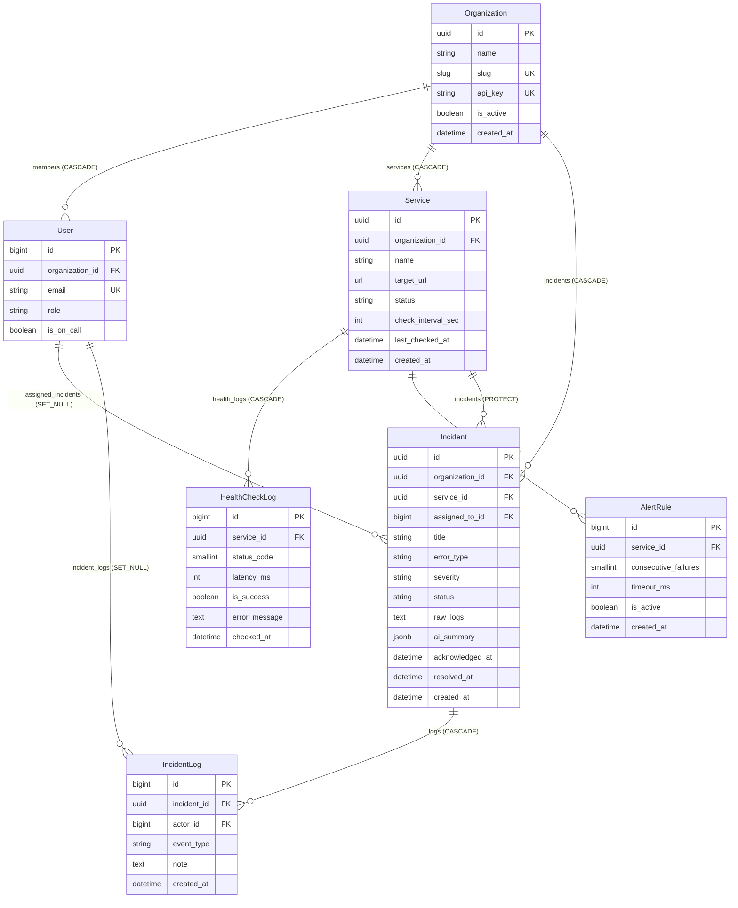

# DispatchPulse — Data Models & Architecture Blueprint

> **System Purpose:** DispatchPulse is an enterprise-grade platform for monitoring web application health, tracking uptime telemetry, managing incident response lifecycles, and accelerating triage with AI-assisted root-cause diagnosis.

---

## 1. High-Level Architecture & Entity Relationship Diagram (ERD)

The data layer is partitioned into three decoupled Django applications:
1. `accounts` — Tenant boundary (`Organization`) and role-based access control (`User`).
2. `monitoring` — Synthetic ping targets (`Service`) and high-volume time-series telemetry (`HealthCheckLog`).
3. `incidents` — Outage tracking (`Incident`), immutable timeline audits (`IncidentLog`), and alerting criteria (`AlertRule`).



---

## 2. Models Breakdown & Architectural Accomplishments

### 2.1. `accounts.Organization`
- **Location:** `backend/accounts/models.py`
- **Primary Key:** `UUIDField` (`default=uuid.uuid4`, non-editable)

| Field | Type | Attributes / Constraints |
| :--- | :--- | :--- |
| `id` | `UUIDField` | `primary_key=True`, non-sequential random UUID |
| `name` | `CharField(max_length=120)` | Display name of the company/tenant |
| `slug` | `SlugField(max_length=140)` | `unique=True`, `db_index=True` |
| `api_key` | `CharField(max_length=64)` | `unique=True`, `db_index=True` |
| `is_active` | `BooleanField` | `default=True` |
| `created_at` | `DateTimeField` | `auto_now_add=True` |

#### What We Accomplish With This Model:
1. **Multi-Tenant Foundation:** Serves as the root boundary for data isolation. Every service, incident, and user is explicitly scoped to an organization to prevent cross-customer data leakage.
2. **Protection Against Sequential ID Scraping (IDOR):** Uses a non-enumerable UUID instead of auto-incrementing integers (`/orgs/1`, `/orgs/2`), preventing attackers from guessing other customer identifiers.
3. **Public Status Page Routing:** The indexed `slug` provides clean, branded URLs for external stakeholders (e.g., `https://dispatchpulse.io/status/acme-corp`).
4. **Programmatic Ingestion (`api_key`):** Allows automated monitoring agents and external CI/CD pipelines to report health status securely without needing user session cookies or passwords.
5. **Instant Tenant Suspension (`is_active`):** Enables customer offboarding or emergency suspension with a single boolean flag, without destroying relational data.

---

### 2.2. `accounts.User`
- **Location:** `backend/accounts/models.py`
- **Inheritance:** `AbstractUser`
- **Authentication Key:** `USERNAME_FIELD = "email"`

| Field | Type | Attributes / Constraints |
| :--- | :--- | :--- |
| `organization` | `ForeignKey(Organization)` | `on_delete=CASCADE`, `related_name="members"`, nullable |
| `email` | `EmailField` | `unique=True` |
| `role` | `CharField(max_length=20)` | `ADMIN`, `RESPONDER`, `VIEWER` (default: `RESPONDER`) |
| `is_on_call` | `BooleanField` | `default=False` |

#### What We Accomplish With This Model:
1. **Modern B2B Email Authentication:** Eliminates legacy username-based login in favor of unique business emails.
2. **Role-Based Access Control (RBAC):**
   - `ADMIN`: Manages billing, invites members, modifies alert rules and endpoints.
   - `RESPONDER`: Triages active outages, triggers AI analyses, acknowledges and resolves incidents.
   - `VIEWER`: Read-only access to internal metrics and dashboards.
3. **On-Call Paging Readiness (`is_on_call`):** Flags which engineers are actively on duty so automated escalation protocols can route critical P1/P2 alerts directly to active responders.

---

### 2.3. `monitoring.Service`
- **Location:** `backend/monitoring/models.py`
- **Primary Key:** `UUIDField` (`default=uuid.uuid4`, non-editable)

| Field | Type | Attributes / Constraints |
| :--- | :--- | :--- |
| `id` | `UUIDField` | `primary_key=True` |
| `organization` | `ForeignKey(Organization)` | `on_delete=CASCADE`, `related_name="services"` |
| `name` | `CharField(max_length=120)` | Service identifier (e.g., "Stripe Gateway", "Auth Service") |
| `target_url` | `URLField` | HTTP/HTTPS endpoint probed by the synthetic worker |
| `status` | `CharField(max_length=20)` | `OPERATIONAL`, `DEGRADED`, `MAJOR_OUTAGE` |
| `check_interval_sec` | `PositiveIntegerField` | Polling frequency in seconds (default: 60s) |
| `last_checked_at` | `DateTimeField` | Timestamp of the most recent probe (nullable) |
| `created_at` | `DateTimeField` | `auto_now_add=True` |

#### What We Accomplish With This Model:
1. **Monitored Asset Representation:** Captures any external or internal HTTP endpoint whose availability must be verified.
2. **High-Performance Dashboard Reads:** Caching the current `status` and `last_checked_at` on the `Service` record avoids running expensive subqueries across millions of historical log rows when rendering the main dashboard.
3. **Flexible Polling Schedules:** Each service can have an independent ping cadence (`check_interval_sec`), allowing critical payment endpoints to be polled every 10 seconds while background sync APIs are checked every 5 minutes.

---

### 2.4. `monitoring.HealthCheckLog`
- **Location:** `backend/monitoring/models.py`
- **Primary Key:** `BigAutoField`
- **Ordering:** `['-checked_at']`

| Field | Type | Attributes / Constraints |
| :--- | :--- | :--- |
| `id` | `BigAutoField` | Sequential 64-bit integer PK |
| `service` | `ForeignKey(Service)` | `on_delete=CASCADE`, `related_name="health_logs"` |
| `status_code` | `PositiveSmallIntegerField` | HTTP response code (e.g., 200, 500, 502) — nullable |
| `latency_ms` | `PositiveIntegerField` | Round-trip probe time in milliseconds — nullable |
| `is_success` | `BooleanField` | Fast filtering boolean (`default=True`) |
| `error_message` | `TextField` | Captures DNS failures, SSL handshake errors, timeouts |
| `checked_at` | `DateTimeField` | `auto_now_add=True`, `db_index=True` |

#### What We Accomplish With This Model:
1. **High-Volume Telemetry Storage:** Scaled for millions of records. Uses a 64-bit `BigAutoField` rather than UUID to maintain tight sequential B-tree indexing on disk, minimizing write amplification during frequent ping cycles.
2. **Safe Logging of Network-Level Failures:** Making `status_code` and `latency_ms` nullable prevents database write exceptions when probes encounter DNS resolution errors, connection drops, or hard socket timeouts where no HTTP response code exists.
3. **Uptime SLA & Latency Percentile Analytics:** The indexed `checked_at` timestamp supports fast time-window queries (e.g., past 24 hours, past 30 days) to compute SLA percentages (99.9% uptime) and average latency graphs.

---

### 2.5. `incidents.Incident`
- **Location:** `backend/incidents/models.py`
- **Primary Key:** `UUIDField` (`default=uuid.uuid4`, non-editable)
- **Ordering:** `['-created_at']`

| Field | Type | Attributes / Constraints |
| :--- | :--- | :--- |
| `id` | `UUIDField` | `primary_key=True` |
| `organization` | `ForeignKey(Organization)` | `on_delete=CASCADE`, `related_name="incidents"` |
| `service` | `ForeignKey(Service)` | `on_delete=models.PROTECT`, `related_name="incidents"` |
| `assigned_to` | `ForeignKey(User)` | `on_delete=models.SET_NULL`, nullable, blankable |
| `title` | `CharField(max_length=255)` | Human-readable outage title |
| `error_type` | `CharField(max_length=30)` | `DATABASE`, `API_TIMEOUT`, `AUTH_SECURITY`, `SERVER_CRASH`, `PERFORMANCE` |
| `severity` | `CharField(max_length=2)` | `P1` (Critical), `P2` (High), `P3` (Moderate), `P4` (Low) |
| `status` | `CharField(max_length=20)` | `TRIGGERED`, `ACKNOWLEDGED`, `RESOLVED` |
| `raw_logs` | `TextField` | Stack traces, HTTP error bodies, and diagnostic output |
| `ai_summary` | `JSONField` | Structured AI diagnosis: `root_cause`, `recommended_fix`, `confidence` |
| `acknowledged_at` | `DateTimeField` | Set when an engineer claims the incident |
| `resolved_at` | `DateTimeField` | Set when the outage is mitigated |
| `created_at` | `DateTimeField` | `auto_now_add=True`, `db_index=True` |

#### What We Accomplish With This Model:
1. **Critical Audit & Compliance Protection (`models.PROTECT`):** Monitored services with incident histories cannot be deleted accidentally. Removing an active service requires dealing with historical incidents first, preserving compliance records.
2. **Personnel Resiliency (`models.SET_NULL`):** If an engineer leaves the company and their user account is deleted, the incident history remains intact with an unassigned status rather than being erased.
3. **Operational Metrics (MTTA & MTTR):**
   - **Mean Time To Acknowledge (MTTA):** `acknowledged_at - created_at`
   - **Mean Time To Resolve (MTTR):** `resolved_at - created_at`
4. **Native AI-Assisted Triage:** The `raw_logs` field feeds error traces into LLM workers (Gemini / Groq), and `ai_summary` stores the structured JSON diagnosis (`{"root_cause": ..., "recommended_fix": ..., "confidence": ...}`). This provides responders with instant, actionable guidance directly inside the incident drawer.
5. **Strict Incident Lifecycle:** Clear state transitions enforce the response workflow:
   $$\text{TRIGGERED} \longrightarrow \text{ACKNOWLEDGED} \longrightarrow \text{RESOLVED}$$

---

### 2.6. `incidents.IncidentLog`
- **Location:** `backend/incidents/models.py`
- **Primary Key:** `BigAutoField`
- **Ordering:** `['created_at']` (Chronological)

| Field | Type | Attributes / Constraints |
| :--- | :--- | :--- |
| `id` | `BigAutoField` | Sequential primary key |
| `incident` | `ForeignKey(Incident)` | `on_delete=CASCADE`, `related_name="logs"` |
| `actor` | `ForeignKey(User)` | `on_delete=models.SET_NULL`, nullable |
| `event_type` | `CharField(max_length=20)` | `TRIGGERED`, `ACKNOWLEDGED`, `RESOLVED`, `COMMENT`, `AI_TRIAGE` |
| `note` | `TextField` | Free-text commentary or auto-generated system message |
| `created_at` | `DateTimeField` | `auto_now_add=True`, `db_index=True` |

#### What We Accomplish With This Model:
1. **Immutable Audit Trail:** Acts as an append-only ledger for all incident lifecycle events. Any status change, note added by a responder, or AI-generated triage step writes a new timestamped event.
2. **Post-Mortem & Timeline Rendering:** Powers the frontend activity timeline, showing a second-by-second chronicle of what happened, who responded, and what remedial steps were taken.
3. **System vs. Human Attribution:** `actor` is nullable. When an automated ping engine or AI agent triggers an event, `actor=None` (system event). When an engineer updates the incident, `actor` references their user record.

---

### 2.7. `incidents.AlertRule`
- **Location:** `backend/incidents/models.py`
- **Primary Key:** `BigAutoField`
- **Ordering:** `['-created_at']`

| Field | Type | Attributes / Constraints |
| :--- | :--- | :--- |
| `id` | `BigAutoField` | Sequential primary key |
| `service` | `ForeignKey(Service)` | `on_delete=CASCADE`, `related_name="alert_rules"` |
| `consecutive_failures` | `PositiveSmallIntegerField` | Number of failures before firing an alert (default: 3) |
| `timeout_ms` | `PositiveIntegerField` | Maximum allowable latency in ms (default: 5000ms) |
| `is_active` | `BooleanField` | Rule active status (`default=True`) |
| `created_at` | `DateTimeField` | `auto_now_add=True` |

#### What We Accomplish With This Model:
1. **Flapping Prevention (Eliminating Alert Fatigue):** Requiring multiple consecutive failed checks (e.g., 3 failed pings) prevents transient network spikes or single packet drops from triggering false alarms and waking up engineers at 3 AM.
2. **SLA-Based Performance Degradation Detection:** `timeout_ms` allows flagging services that are technically responding (HTTP 200) but are unacceptably slow (e.g., taking >5000ms), shifting the service state to `DEGRADED` before a full crash occurs.
3. **Maintenance Window Controls:** `is_active=False` allows pausing incident creation during scheduled maintenance or deployments without deleting the configured rule.

---

## 3. End-to-End Operational Lifecycle

The seven models collaborate in an event-driven flow:

```
[ Synthetic Pinger Engine ]
         │
         ▼  (Pings target_url)
[ HealthCheckLog created ]
         │
         ├─── Check latency & status_code against [ AlertRule ]
         │
         ▼  (If consecutive_failures threshold breached)
[ Service.status updated to DEGRADED or MAJOR_OUTAGE ]
         │
         ▼
[ Incident created ] (status = TRIGGERED, severity = P1-P4)
         │
         ├─── Creates [ IncidentLog ] (event_type = TRIGGERED)
         │
         ▼
[ AI Triage Worker ]
         │  (Analyzes raw_logs + error_type)
         ▼
[ Incident.ai_summary populated ] + [ IncidentLog ] (event_type = AI_TRIAGE)
         │
         ▼
[ On-Call Engineer claims ] ───> [ Incident.acknowledged_at set ] ───> [ IncidentLog ] (ACKNOWLEDGED)
         │
         ▼
[ Root cause fixed ] ──────────> [ Incident.resolved_at set ] ───────> [ IncidentLog ] (RESOLVED)
                                 [ Service.status restored to OPERATIONAL ]
```

---

## 4. Key Design Decisions Summary Table

| Model | Primary Key Strategy | Deletion Constraint | Indexing Strategy | Primary Problem Solved |
| :--- | :--- | :--- | :--- | :--- |
| **`Organization`** | UUID v4 | N/A (Root) | Unique indexes on `slug` & `api_key` | Multi-tenancy isolation & IDOR prevention |
| **`User`** | BigAutoField | `CASCADE` on Org | Unique index on `email` | Role-based permissions & on-call routing |
| **`Service`** | UUID v4 | `CASCADE` on Org | Ordered by `-created_at` | Monitored target definition & status caching |
| **`HealthCheckLog`** | BigAutoField | `CASCADE` on Service | `db_index=True` on `checked_at` | Scalable high-frequency ping telemetry |
| **`AlertRule`** | BigAutoField | `CASCADE` on Service | Ordered by `-created_at` | Anti-flapping threshold configuration |
| **`Incident`** | UUID v4 | `PROTECT` on Service, `SET_NULL` on User | `db_index=True` on `created_at` | Outage lifecycle, AI triage storage & MTTA/MTTR |
| **`IncidentLog`** | BigAutoField | `CASCADE` on Incident, `SET_NULL` on User | `db_index=True` on `created_at` | Immutable post-mortem event ledger |
